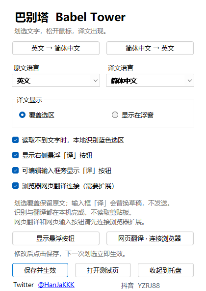
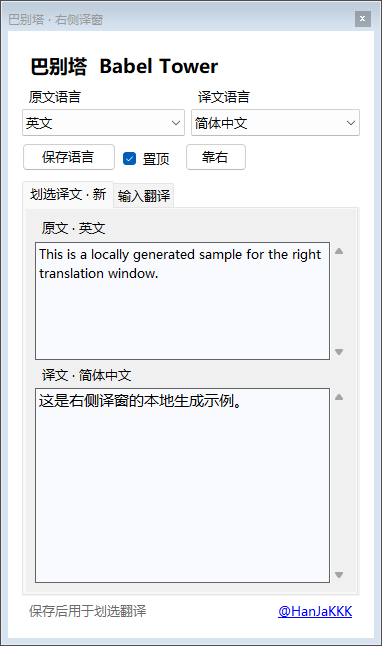

# Babel Tower / 巴别塔

The local enhanced selection translator, unified as **Babel Tower v0.2.0**: select text, read a translation, translate a webpage, or translate a finished draft inside its input field.

Babel Tower builds on the existing enhanced Windows translator. It retains Windows UI Automation selection reading, conservative blue-selection OCR, and Tencent Hy-MT2-1.8B inference through local Ollama. The repository is also a reusable Codex skill. Selection translation uses a visual overlay and preserves the source document. Clicking an input field's **译** button deliberately replaces that field's draft without sending it.

Created by **[@HanJaKKK](https://x.com/HanJaKKK)**. [中文说明](README.zh-CN.md)





Previews render the production controls with synthetic text. They are not screenshots of a live user's app. See [validation and limitations](VALIDATION.md).

## Features

- Keeps the enhanced selection pipeline: UI Automation first, matching installed Windows OCR for supported visible blue selections, and revalidation before displaying the result. Unclear or changed selections are abandoned.
- Shows a visual translation over the selected area when it fits, with a nearby popup for the full result when needed. Click elsewhere or press **Esc** to dismiss that display.
- Offers 38 language entries from the current Hy-MT2 model table, plus automatic source detection. English → Chinese and Chinese → English presets remain available.
- Keeps original and translated selection text in a right-side window. Its separate **输入翻译** tab accepts manual text without letting later selections overwrite the draft.
- Places a small **译** button beside eligible native Windows input fields. Clicking translates the complete draft, writes back only if the field and its text still match, and never sends it.
- Includes an optional Chrome/Edge extension for **one-click webpage translation**, **restore original**, and **译** beside supported focused web inputs. The extension must be loaded and paired explicitly.

The shipped application uses local Ollama. It does not read the clipboard, send selected text or images to a cloud translator, or switch providers after an error. Initial model download and Ollama installation/update traffic need a connection; OCR and translation run locally after setup. The tray menu can pause selection translation or reopen settings and the right panel.

## Requirements

- Windows 10/11 x64, Windows PowerShell 5.1 or later, and .NET Framework 4.8.
- [Ollama for Windows](https://ollama.com/download/windows), installed and running locally before model setup or app startup.
- Space for the approximately **1.1 GB** GGUF download and Ollama's imported model copy.
- A matching installed Windows OCR language pack for image fallback. Choosing a model language does not install an OCR language. Text selections read through UI Automation do not require OCR packs.
- Chrome or Edge for the optional Manifest V3 browser extension, supplied as an unpacked folder.

A compatible GPU can accelerate the local model. CPU operation is possible; latency depends on hardware, model loading, text length and other workloads. Selectable languages do not imply equal accuracy or verification of every language pair.

## Quick start

Download and extract a Windows package from [Releases](https://github.com/roushan11111/babel-tower/releases), or clone the source:

```powershell
git clone https://github.com/roushan11111/babel-tower.git
Set-Location .\babel-tower
```

Install and open Ollama, then explicitly prepare the model once:

```powershell
powershell.exe -NoProfile -ExecutionPolicy Bypass -File .\scripts\setup-model.ps1
```

This downloads Tencent's official GGUF, verifies its SHA256, and imports it into local Ollama. The downloaded file is stored under `%LOCALAPPDATA%\BabelTower\models` by default. To choose another download directory:

```powershell
powershell.exe -NoProfile -ExecutionPolicy Bypass -File .\scripts\setup-model.ps1 -ModelDirectory "D:\BabelTower\models"
```

If you already have the official GGUF, verify and import it without another download:

```powershell
powershell.exe -NoProfile -ExecutionPolicy Bypass -File .\scripts\setup-model.ps1 -ModelPath "D:\Models\Hy-MT2-1.8B-Q4_K_M.gguf"
```

Launch:

```powershell
powershell.exe -NoProfile -ExecutionPolicy Bypass -File .\scripts\start.ps1
```

The startup script builds `dist/BabelTower.exe` if necessary, then checks the running local Ollama service and verified model weights. It does not start Ollama or download weights automatically. Open Ollama first. The app warms the local model, so the first request may take longer. Model setup and inference use `127.0.0.1:11434`.

The settings window is titled **巴别塔 · 本地增强版 0.2.0**. Choose an English/Chinese preset or another source/target direction, then click **保存并生效** (Save and apply). The next request uses that direction. The same window enables the right panel, native input button, and browser connection. Close settings to keep the tool in the tray; double-click its icon to reopen. Add `-Background` to the startup command to begin there directly. Automatic startup at sign-in is not configured.

When upgrading an existing enhanced translator, exit its tray instance first, then launch the new executable. The preserved single-instance guard prevents two copies from competing for selections. Existing verified weights can be reused: the model alias has not changed.

To check an existing build, the running Ollama service and verified weights without launching the application or Ollama:

```powershell
powershell.exe -NoProfile -ExecutionPolicy Bypass -File .\scripts\start.ps1 -CheckOnly
```

## Right panel and native input translation

Enable **划选翻译同时保留在右侧译窗** and save, or click **打开右侧译窗**. The **划选译文** tab shows source and result; **输入翻译** is an independent draft area. The panel provides source/target selectors, **保存语言**, pinning and **靠右** alignment. Closing it hides the panel; the tray menu can reopen it.

Enable **可编辑输入框旁显示「译」按钮** and save. Focus a supported field, finish your sentence, and click **译**. This replaces the entire draft and never presses Enter or clicks Send. Editing the draft or changing focus during translation abandons the write. The native path is deliberately limited to writable, non-password Win32 `Edit` controls exposing usable UI Automation `ValuePattern`; the button may not appear in other applications.

## Connect Chrome or Edge

1. Run Babel Tower. Enable **浏览器网页翻译连接（需要扩展）**, save, then open **网页翻译 · 连接浏览器**. This window opens the supplied `browser-extension` folder and displays this installation's pairing code.
2. Open `chrome://extensions` or `edge://extensions`, enable **Developer mode**, choose **Load unpacked**, and select `browser-extension`. Babel Tower does not change browser profiles or install the extension silently.
3. Open the extension's **连接设置与使用说明**, enter the pairing code, and click **保存并检查连接**. The status should read **已连接本机巴别塔**. Refresh an already-open normal webpage after loading the extension.
4. Click Babel Tower in the browser toolbar and choose **一键翻译当前网页**. **停止翻译** stops a running job; **还原原文** restores translated text that the page has not subsequently changed.
5. In a supported focused text input, textarea, or plain-text contenteditable editor, finish the draft and click its small **译** button. The translation remains an unsent draft. Password/verification fields, protected content and unsupported complex editors are skipped.

The extension uses the saved app direction; **保存翻译方向** in its popup also updates the app. Page translation reads supported webpage text after an explicit click, skips inputs and code, and keeps originals in memory for restoration. Long pages may take time or have skipped sections. Newly loaded text needs another click. Browser-internal pages, extension stores, PDFs, embedded frames (iframes) and image text are outside this first version.

Each browser webpage/input translation request waits up to **25 seconds**. A timeout leaves unfinished text unchanged; retry after model warmup or with a shorter input. **Stop** prevents writeback and further page nodes, but model computation already submitted may continue briefly.

The browser bridge is fixed to `http://127.0.0.1:17863`. Its per-installation 64-character hexadecimal pairing code is stored beside the executable in `browser-bridge.json`; keep this local file out of archives and public repositories. The extension stores the code in trusted extension `storage.local`, not webpage content. Requests go through the local bridge to the same local model. See [browser-extension/README.md](browser-extension/README.md) for extension setup and limitations.

If the connection window reports that the port is unavailable or Windows denies URL listener access, selection translation and the right panel remain usable. A free TCP port does not establish the required Windows URL permission. The application reports the listener error and does not elevate itself or change system URL ACLs automatically.

## Languages and OCR

The menu includes simplified and traditional Chinese, English, Japanese, Korean, French, German, Spanish, Russian, Portuguese, Turkish, Arabic, Thai, Italian, Vietnamese, Malay, Indonesian, Filipino, Hindi, Polish, Czech, Dutch, Khmer, Burmese, Persian, Gujarati, Urdu, Telugu, Marathi, Hebrew, Bengali, Tamil, Ukrainian, Tibetan, Kazakh, Mongolian, Uyghur and Cantonese. These are selectable model language entries, not a claim that every pair has been tested.

For OCR, explicitly choose the source language when possible. Automatic source selection uses the English/Chinese directions as hints for the image recognizer; it cannot infer every OCR language from the target alone. A missing matching recognizer produces a clear message instead of silently using another language.

## Install as a Codex skill

This repository is also the skill folder. Clone it under the name `babel-tower` into your configured Codex skill directory. On a default Windows installation:

```powershell
$babelSkillDirectory = Join-Path $env:USERPROFILE '.codex\skills\babel-tower'
git clone https://github.com/roushan11111/babel-tower.git $babelSkillDirectory
```

For a custom `CODEX_HOME`, use its `skills` subfolder. Refresh skill discovery or restart Codex, then ask:

```text
Use $babel-tower to set up the enhanced local translator and connect webpage and input translation on this Windows computer.
```

The skill builds, launches, configures and troubleshoots this application. Installing it alone does not install Ollama, model weights or the browser extension.

## Build from source

```powershell
powershell.exe -NoProfile -ExecutionPolicy Bypass -File .\scripts\build.ps1
```

The application uses the Windows/.NET Framework compiler and platform libraries. Visual Studio, Node.js, Python and cloud credentials are not required for this app build. The output is `dist/BabelTower.exe`.

| Path | Purpose |
| --- | --- |
| `SKILL.md` | Codex skill entry point |
| `agents/openai.yaml` | Skill UI metadata |
| `assets/app/` | C# application sources and Windows manifest |
| `browser-extension/` | Optional Chrome/Edge extension |
| `scripts/build.ps1` | Compile the application |
| `scripts/start.ps1` | Check prerequisites and launch |
| `scripts/setup-model.ps1` | Explicit model download or verified local import |
| `dist/BabelTower.exe` | Local build / Windows package executable |

## Compatibility and validation

Selection access depends on the source application. Custom canvases, game UIs, protected input, non-blue highlights, obscured text and some elevated apps may not work. OCR can reject unclear selections and still misread small text or Chinese glyphs. Model translation can mistranslate terminology, nuances or punctuation.

The existing enhanced translator's Chinese overlay was observed in an earlier Notepad test and confirmed by the user in their GPT window. v0.2.0 has passed settings, right-panel, native-input, local-bridge and controlled browser-extension checks. The new combined desktop flow and the user's GPT webpage workflow have not yet been manually verified; earlier observations and controlled fixtures do not establish those results. See [VALIDATION.md](VALIDATION.md) for the exact scope.

If no selection result appears, wait for model warmup and try one complete English sentence in a standard text control. **查看运行状态** in the tray reports stages and gesture counts without recording selected text. A changed selection needs another attempt. A nearby popup can mean the translation does not fit the selected area or visual covering is disabled. A missing native **译** button can mean the field is outside the supported control type; browser inputs use the paired extension.

## Model and credits

Application code, browser extension and Codex skill use the [MIT License](LICENSE). Model weights, Ollama and Windows components have separate terms; see [third-party notices](THIRD_PARTY_NOTICES.md).

- Creator: [@HanJaKKK on X / Twitter](https://x.com/HanJaKKK).
- Translation model: [Tencent Hy-MT2-1.8B GGUF](https://huggingface.co/tencent/Hy-MT2-1.8B-GGUF), Q4_K_M. The official model card lists Apache-2.0. Weights are not bundled in the repository or release archives.
- Local inference: [Ollama](https://github.com/ollama/ollama).
- Image recognition: [Windows Media OCR](https://learn.microsoft.com/en-us/uwp/api/windows.media.ocr.ocrengine).

The alias remains `swipetranslate-hymt2` for existing installations. Model setup verifies this official GGUF SHA256 before import:

```text
dc5f44fcf1fa496ee7ad725982c0c8c553a4de00259b53af84c4b89fb0c06699
```
